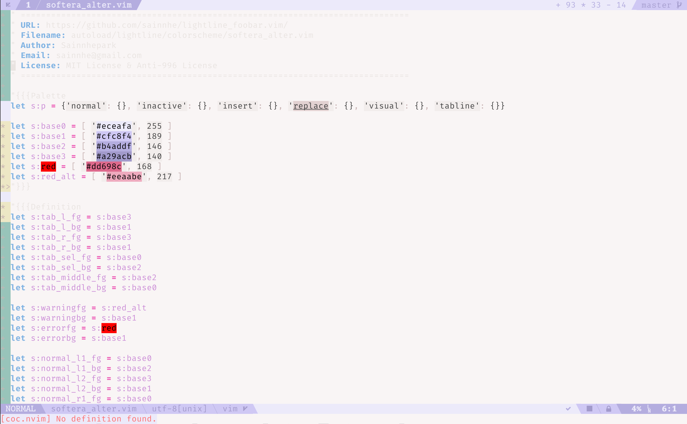

# Demo


`let g:lightline.colorscheme = 'ayu_light'` && [ayu](https://github.com/ayu-theme/ayu-vim)



`let g:lightline.colorscheme = 'softera_alter'` && [soft-era](https://github.com/sainnhe/soft-era-vim) modified version


`let g:lightline.colorscheme = 'deus_beta'` && [neodark](https://github.com/KeitaNakamura/neodark.vim) and [seoul256](https://github.com/junegunn/seoul256.vim)

# Installation

for [vim-plug](https://github.com/junegunn/vim-plug):

```
Plug 'sainnhe/lightline_foobar.vim'
```

# Usage

put this in your vimrc:

```
let g:lightline.colorscheme = 'foobar'
```

or if you want to apply it without reload:

```
:let g:lightline.colorscheme = 'foobar'
:call lightline#init()
:call lightline#colorscheme()
:call lightline#update()
```

where `foobar` is the name of a color scheme.

check [Demo](https://github.com/sainnhe/lightline_foobar.vim#demo) for all available color schemes.
